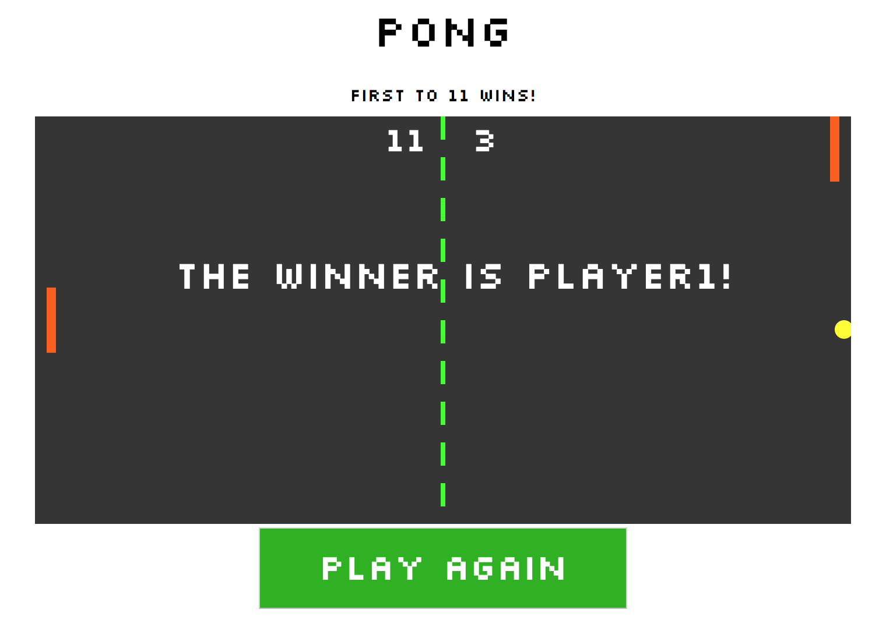
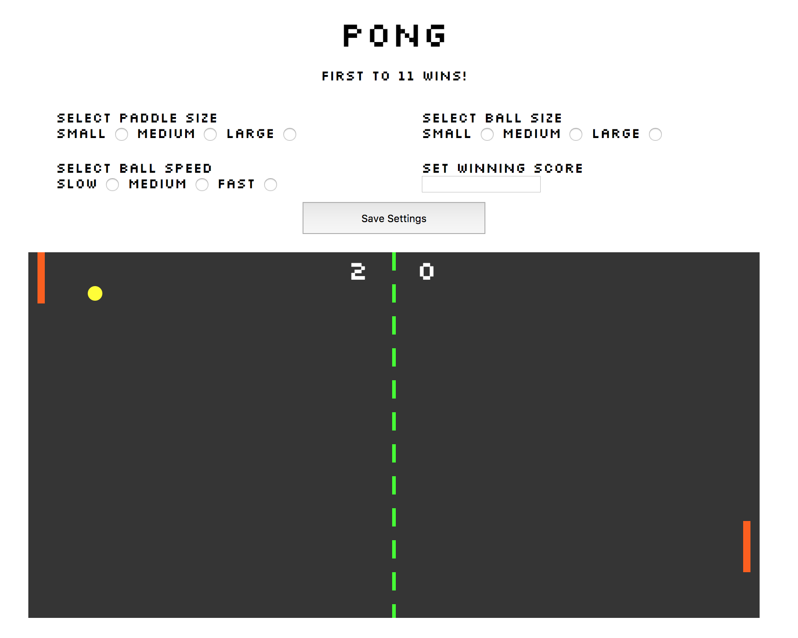

# Pong Game

This is my third project with the Red Academy, which consists of a simple pong game built using object oriented javascript programming. 

## How to play:
First to 11 wins!
You can change the winning score by changing the winningScore property on Game.js . 

**Player 1 Keys:**
* a: up
* z: down

**Player 2 Keys:**
* ▲ : up
* ▼: down

Click on Play Again once a winner has been declared. 

## How this was built:
This was the first time I used ocject oriented programming to build anything. The game uses 5 classes to build the pong game: a game class, a ball class, a board class, a paddle class, and a score class. 

Each class sets the properties and methods for each element of the game and everything is compiled and rendered under the game class at Game.js. 

The index.js file is used to import the css styles and instantiate the game class and the game loop which makes the game run. The global settings for the game, like the SVG namespace and the game keys are found at settings.js. 

## What's Next?
Most of the game was made as part of a code-along during class, with extra elements, like the winning score, styling and Play Again button built by myself. 

Initially, my goal was to build a form where the player could set the paddle size, ball size, ball speed and winning score for the game. I thought it would be a simple task of attaching the values in the form to variables and using those variables to change the paddle, ball and score. 

When I first created the form, I used radio buttons, but that was causing some bugs when I tried to extract all the values. Instead, I changed the radio buttons to dropdown menus. This made it easier to extract the values and put them into variables.

When I finally solved this problem I ran into a bigger problem, where I was not able to assign the variables to the classes that render the paddle, ball and score. With the help of my Red instructors I came to realize I will have to create a landing page where the user will set the cutom properties before rendering the game. That's what I will be working on when I come back to this. 

In the meantime, the working code for that version of the game can be found in the pong-stretch branch.  

